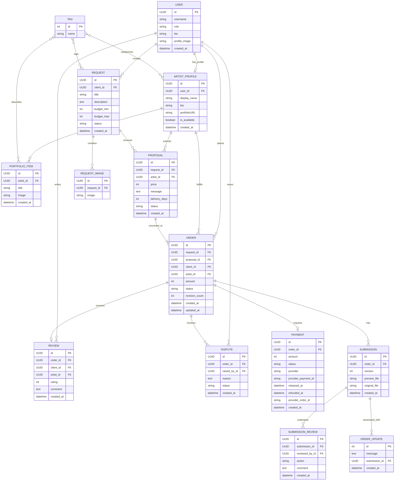

# Database Schema and ER Diagram

## 1. Chen's Notation ER Diagram
Based on the provided classical ER diagram symbols:
*   **Rectangles**: Entities
*   **Ellipses**: Attributes
*   **Diamonds**: Relationships
*   **Lines**: Links

```mermaid
flowchart TD
    %% Entities
    User[User]
    ArtistProfile[ArtistProfile]
    PortfolioItem[PortfolioItem]
    Tag[Tag]
    Request[Request]
    RequestImage[RequestImage]
    Proposal[Proposal]
    Order[Order]
    Submission[Submission]
    SubmissionReview[SubmissionReview]
    OrderUpdate[OrderUpdate]
    Review[Review]
    Dispute[Dispute]
    Payment[Payment]

    %% Relationships
    User_ArtistProfile{has_profile}
    User --- User_ArtistProfile --- ArtistProfile

    ArtistProfile_PortfolioItem{has_portfolio}
    ArtistProfile --- ArtistProfile_PortfolioItem --- PortfolioItem

    Tag_ArtistProfile{artist_tags}
    Tag --- Tag_ArtistProfile --- ArtistProfile

    Tag_PortfolioItem{item_tags}
    Tag --- Tag_PortfolioItem --- PortfolioItem

    Tag_Request{request_tags}
    Tag --- Tag_Request --- Request

    User_Request{creates_request}
    User --- User_Request --- Request

    Request_RequestImage{has_image}
    Request --- Request_RequestImage --- RequestImage

    Request_Proposal{receives_proposal}
    Request --- Request_Proposal --- Proposal

    ArtistProfile_Proposal{submits_proposal}
    ArtistProfile --- ArtistProfile_Proposal --- Proposal

    Request_Order{has_order}
    Request --- Request_Order --- Order

    Proposal_Order{converted_to}
    Proposal --- Proposal_Order --- Order

    User_Order{client_order}
    User --- User_Order --- Order

    ArtistProfile_Order{artist_order}
    ArtistProfile --- ArtistProfile_Order --- Order

    Order_Submission{has_submission}
    Order --- Order_Submission --- Submission

    Submission_SubmissionReview{has_review}
    Submission --- Submission_SubmissionReview --- SubmissionReview

    User_SubmissionReview{reviewer}
    User --- User_SubmissionReview --- SubmissionReview

    Submission_OrderUpdate{has_update}
    Submission --- Submission_OrderUpdate --- OrderUpdate

    Order_Review{has_final_review}
    Order --- Order_Review --- Review

    User_Review{client_review}
    User --- User_Review --- Review

    ArtistProfile_Review{artist_review}
    ArtistProfile --- ArtistProfile_Review --- Review

    Order_Dispute{has_dispute}
    Order --- Order_Dispute --- Dispute

    User_Dispute{raises_dispute}
    User --- User_Dispute --- Dispute

    Order_Payment{has_payment}
    Order --- Order_Payment --- Payment

    %% Attributes - User
    U_id([id])
    U_username([username])
    U_role([role])
    U_bio([bio])
    U_profile_image([profile_image])
    U_created_at([created_at])
    User --- U_id
    User --- U_username
    User --- U_role
    User --- U_bio
    User --- U_profile_image
    User --- U_created_at

    %% Attributes - ArtistProfile
    AP_id([id])
    AP_user([user_id])
    AP_display([display_name])
    AP_bio([bio])
    AP_portfolioURL([portfolioURL])
    AP_avail([is_available])
    AP_created([created_at])
    ArtistProfile --- AP_id
    ArtistProfile --- AP_user
    ArtistProfile --- AP_display
    ArtistProfile --- AP_bio
    ArtistProfile --- AP_portfolioURL
    ArtistProfile --- AP_avail
    ArtistProfile --- AP_created

    %% Attributes - PortfolioItem
    PI_id([id])
    PI_artist([artist_id])
    PI_title([title])
    PI_image([image])
    PI_created([created_at])
    PortfolioItem --- PI_id
    PortfolioItem --- PI_artist
    PortfolioItem --- PI_title
    PortfolioItem --- PI_image
    PortfolioItem --- PI_created

    %% Attributes - Tag
    T_id([id])
    T_name([name])
    Tag --- T_id
    Tag --- T_name

    %% Attributes - Request
    Req_id([id])
    Req_client([client_id])
    Req_title([title])
    Req_desc([description])
    Req_bmin([budget_min])
    Req_bmax([budget_max])
    Req_status([status])
    Req_created([created_at])
    Request --- Req_id
    Request --- Req_client
    Request --- Req_title
    Request --- Req_desc
    Request --- Req_bmin
    Request --- Req_bmax
    Request --- Req_status
    Request --- Req_created

    %% Attributes - RequestImage
    RI_id([id])
    RI_req([request_id])
    RI_img([image])
    RequestImage --- RI_id
    RequestImage --- RI_req
    RequestImage --- RI_img

    %% Attributes - Proposal
    Prop_id([id])
    Prop_req([request_id])
    Prop_artist([artist_id])
    Prop_price([price])
    Prop_msg([message])
    Prop_del([delivery_days])
    Prop_stat([status])
    Prop_created([created_at])
    Proposal --- Prop_id
    Proposal --- Prop_req
    Proposal --- Prop_artist
    Proposal --- Prop_price
    Proposal --- Prop_msg
    Proposal --- Prop_del
    Proposal --- Prop_stat
    Proposal --- Prop_created

    %% Attributes - Order
    Ord_id([id])
    Ord_req([request_id])
    Ord_prop([proposal_id])
    Ord_client([client_id])
    Ord_artist([artist_id])
    Ord_amt([amount])
    Ord_stat([status])
    Ord_rev([revision_count])
    Ord_created([created_at])
    Ord_updated([updated_at])
    Order --- Ord_id
    Order --- Ord_req
    Order --- Ord_prop
    Order --- Ord_client
    Order --- Ord_artist
    Order --- Ord_amt
    Order --- Ord_stat
    Order --- Ord_rev
    Order --- Ord_created
    Order --- Ord_updated

    %% Attributes - Submission
    Sub_id([id])
    Sub_ord([order_id])
    Sub_ver([version])
    Sub_prev([preview_file])
    Sub_orig([original_file])
    Sub_created([created_at])
    Submission --- Sub_id
    Submission --- Sub_ord
    Submission --- Sub_ver
    Submission --- Sub_prev
    Submission --- Sub_orig
    Submission --- Sub_created

    %% Attributes - SubmissionReview
    SR_id([id])
    SR_sub([submission_id])
    SR_rev([reviewed_by_id])
    SR_act([action])
    SR_comm([comment])
    SR_created([created_at])
    SubmissionReview --- SR_id
    SubmissionReview --- SR_sub
    SubmissionReview --- SR_rev
    SubmissionReview --- SR_act
    SubmissionReview --- SR_comm
    SubmissionReview --- SR_created

    %% Attributes - OrderUpdate
    OU_id([id])
    OU_msg([message])
    OU_sub([submission_id])
    OU_created([created_at])
    OrderUpdate --- OU_id
    OrderUpdate --- OU_msg
    OrderUpdate --- OU_sub
    OrderUpdate --- OU_created

    %% Attributes - Review
    Rev_id([id])
    Rev_ord([order_id])
    Rev_client([client_id])
    Rev_artist([artist_id])
    Rev_rating([rating])
    Rev_comm([comment])
    Rev_created([created_at])
    Review --- Rev_id
    Review --- Rev_ord
    Review --- Rev_client
    Review --- Rev_artist
    Review --- Rev_rating
    Review --- Rev_comm
    Review --- Rev_created

    %% Attributes - Dispute
    Disp_id([id])
    Disp_ord([order_id])
    Disp_rais([raised_by_id])
    Disp_reas([reason])
    Disp_stat([status])
    Disp_created([created_at])
    Dispute --- Disp_id
    Dispute --- Disp_ord
    Dispute --- Disp_rais
    Dispute --- Disp_reas
    Dispute --- Disp_stat
    Dispute --- Disp_created

    %% Attributes - Payment
    Pay_id([id])
    Pay_ord([order_id])
    Pay_amt([amount])
    Pay_stat([status])
    Pay_prov([provider])
    Pay_prov_id([provider_payment_id])
    Pay_rel([released_at])
    Pay_ref([refunded_at])
    Pay_prov_ord([provider_order_id])
    Pay_created([created_at])
    Payment --- Pay_id
    Payment --- Pay_ord
    Payment --- Pay_amt
    Payment --- Pay_stat
    Payment --- Pay_prov
    Payment --- Pay_prov_id
    Payment --- Pay_rel
    Payment --- Pay_ref
    Payment --- Pay_prov_ord
    Payment --- Pay_created
```

## 2. Complete Relational Database Schema
This diagram uses standard Crow's Foot notation to illustrate all tables, columns, foreign keys, and cardinalities in the system.

